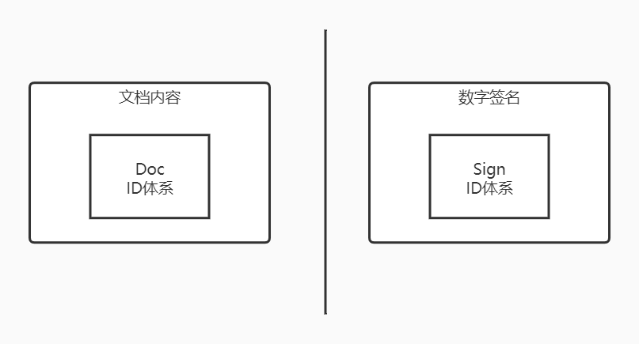
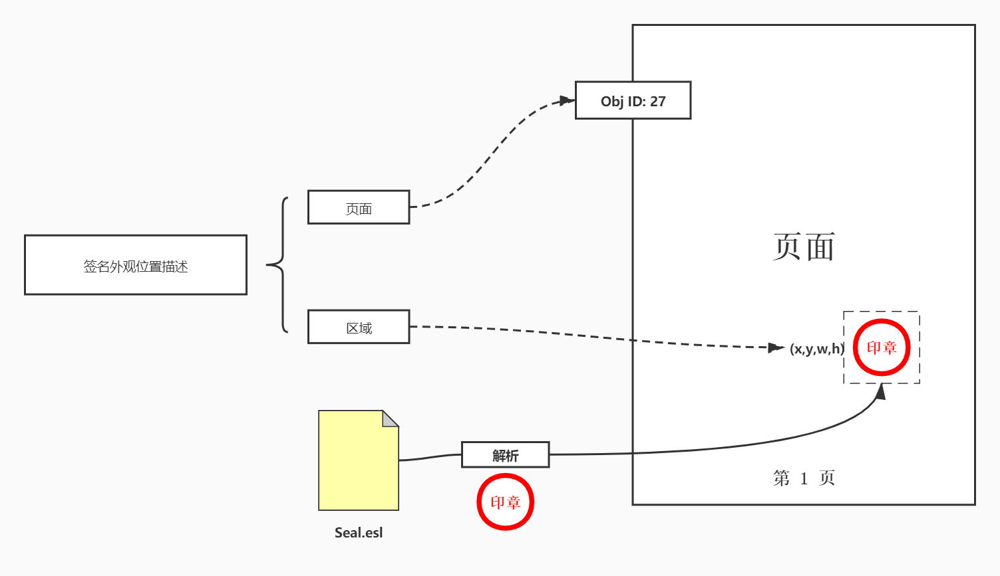
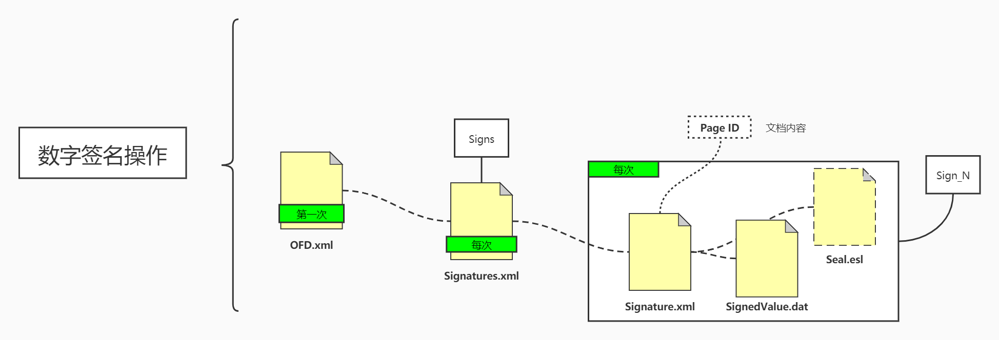
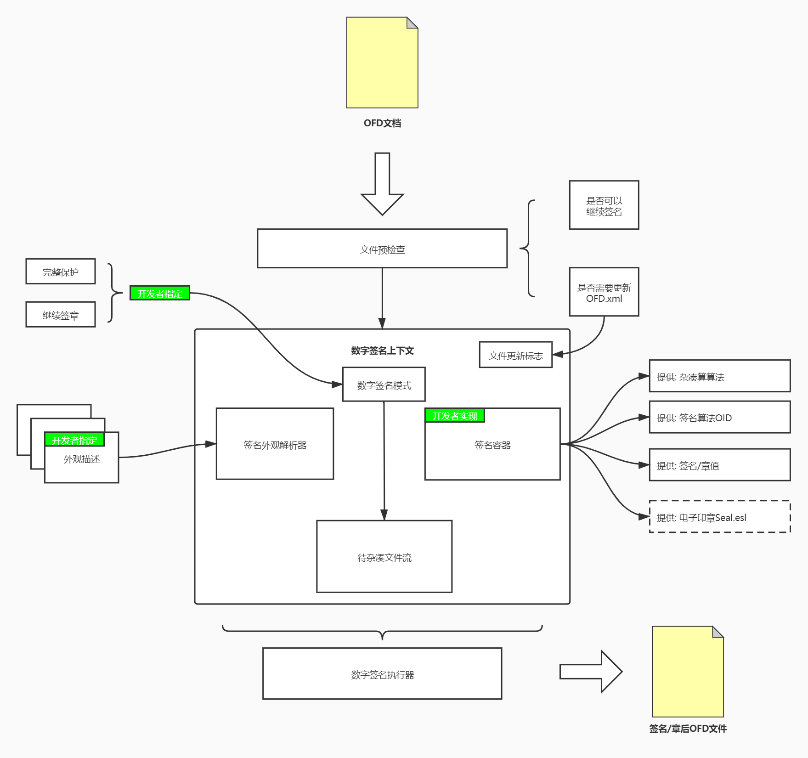

# OFD Reader & Writer 数字签名

**免责声明：电子文档的电子签章流程需要符合国家相关标准和规范。要产生具有效力的电子签名/签章，请使用符合国家密码局要求具有相关型号证书的密码设备进行。**

- [快速开始OFD 签名/签章](doc/quickstart/README.md)

## 标准对数字签名的描述

内容来自于[《GB/T 33190-2016 电子文件存储与交换格式版式文档》](../GBT_33190-2016_电子文件存储与交换格式版式文档.pdf) 
18章 数字签名。

在文档结构章节中我们可以看到在虚拟容器系统中OFD数字签名相关的独立容器

关于签名列表文件和签名文件的介绍下方直接引用了标准内容：

**签名列表：**

签名列表文件的入口点在 7.4 主入口中定义。签名列表文件中可以包含多个签名（例如联合发文等情况），见图 85。
当允许下次继续添加签名时，该文件不会被包含到本次签名的保护文件列表（References）中。

**签名文件：**

OFD的数字签名通过对描述文件的保护间接实现对OFD原文的保护。
签名结构中的签名信息（SignedInfo）是这一过程中的关键点，
其中记录了当次数字签名保护的所有文件的二进制摘要信息，同时
将安全算法提供者、签名算法、签名时间、和所应用的安全印章等
信息也包含在此节点内。签名描述文件同时包含了签名值将要存放的
包内位置，一旦对该文件实施签名保护，则其对应的包内文件原文
以及本次签名对应的附加信息都将不可改动，从而实现依次数字签名
对整个原文内容的保护。签名描述文件的主要结构描述见图 86。

### 体系

数字签名的体系结构如下：

对于整个文档来说有一份数字签名列表的清单，记录该文档相关的所有数字签名信息位置
也就是 **签名列表文件** `Signatures.xml`。

签名列表文件存储的各个签名文件的位置，签名文件中包含一系列的数据用于保护文档，
而签名文件就是待签名的数据（To Be Sign, TBS）。

签名文件中主要是两个部分构成：

- 文件杂凑值清单，描述所保护的文件的杂凑值清单。
- 外观位置描述，它描述了签章可视化的注解所在的页面和页面内坐标。

OFD中文档和数字签名时两个相对独立的模块，他们各自拥有独立的ID体互不干扰。

### 签章外观

文档体系和签名体系相对独立，因此数字签名在表示外观时采用了 **页面 + 位置** 的方式来描述签名的外观位置。

签名/章的图片是由阅读器解析电子印章文件（`Seal.esl`）得到可视化图章效果。

如下：

## 数字签名分析

数字签名涉及文件如下：

1. 由于在文档入口文件（`OFD.xml`）中`Signatures`是可选的，因此在增加
数据签名时可能需要修改文档入口文件增加签名列表文件（`Signatures.xml`）的位置。
这个修改只需要一次，之后就不再需要修改文档入口文件（`OFD.xml`）。
2. 每次对文档进行数字签名都需要在签名列表文件（`Signatures.xml`）中加入一个新列表用于指明签名/签章描述文件位置。
3. 为了容器数字签名相关的文件还需要创建一个新的虚拟容器（`Sign_N/`）。
4. 每次签名需要向容器中加入签名/签章描述文件（`Signature.xml`）、电子印章文件（`Seal.esl`）、签名值文件（`SignedValue.dat`）。

## 数字签名引擎设计

为了让开发者不需要关心OFD电子签名的实现系统，OFDRW-Sign模块对OFD数字签名实现逻辑
进行了封装，最终结果就是构建了数字签名引擎。

数字签名引擎结构如下：

主要包含以下模块

- 预检查。
- 待杂凑文件流构建器。
- 签名外观解析器。
- 数字签名容器。
- 数字签名执行器。

**预检查** 是整个引擎的入口，文件从这里输入解析器在这里开始进行部分的初始化工作，
它主要是分析OFD文件结构是否正确，以及是否具备数字签名的条件：已签名保护文件不包含签名列表文件（Signatures.xml）

**待杂凑文件流构建器**，需要开发手动指定数字签名的模式：

- 继续数字签名模式
       
    该模式下不会保护签名列表文件（Signatures.xml），但是用户可以继续对OFD文件添加新的数字签名。
- 完整保护模式

    该模式将会保护OFD中的所有文件，但是一旦使用该模式数字签名那么该文档不允许继续添加其他签名。

该模块则是根据模式来决定哪些文件需要被保护，
从而产生一个文件信息列表，
这个列表中文件将会按照标准中提及的方法被计算杂凑值。

**签名外观解析器**，OFD中签名的外观是一个个OFD的注解对象实现，
为了便于开发者的指定签章的方式和位置，对签章位置进行了逻辑上的抽象
提供了一系列的外观对象类型，便于指定位置，从而隐藏实现细节。
该解析器的目的就是把逻辑对象翻译为OFD中的对象，为OFD构造签章外观。

**数字签名容器**，在整个数字签名过程中需要使用到一些密码算法，
为了让签章过程更加灵活，此处使用了扩张签名容器对象来让开发者手动
指定一些数字签名过程中使用的算法和标识，该容器将会在数字签名执行器中
以适当的方式进行调用。

**数字签名执行器**，执行符合OFD标准要求的数字签章，并构建签章后的OFD对象。